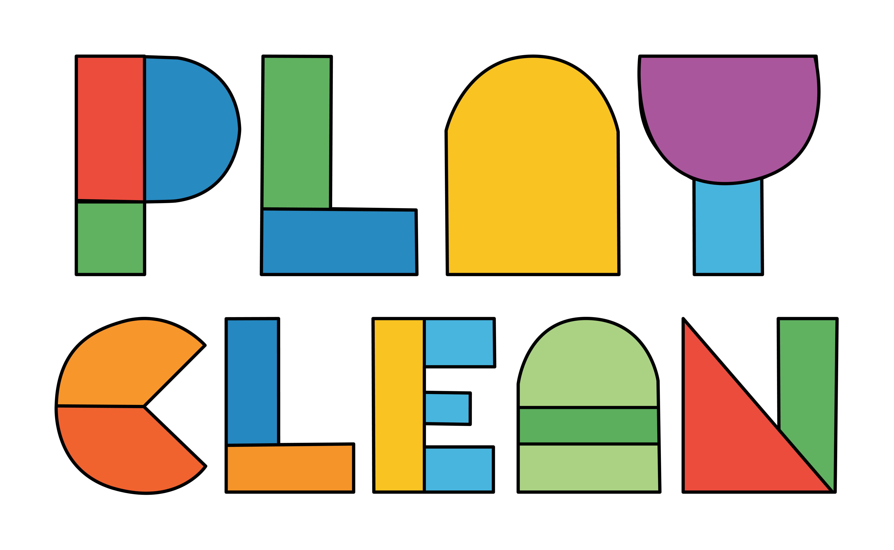
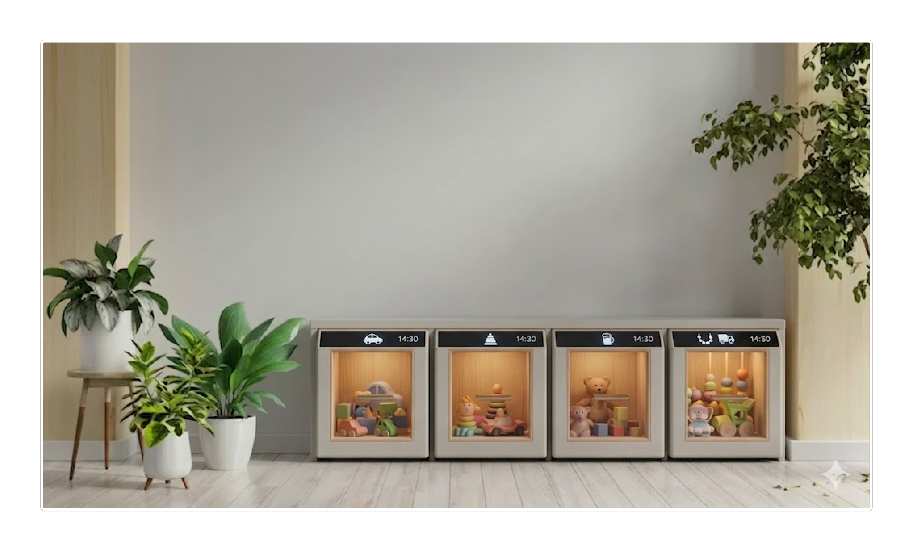

# Projecttitel
*PlayClean — Play. Clean. Repeat.* 

  

🛠️ Built by ``Rahul Jaswal`` & ``Arthur Verhaeghe``   
🔥 Supervised by ``prof. dr. Bas Baccarne``, ``Yannick Christiaens`` & ``Wouter Devriese``    
🌱 Grown at ``Ghent University`` 🏛️ ``Industrial Design Engineering`` ([project overview](https://github.com/basbaccarne/human-centered-design))       

*13/11/2025 van de laatste update*   

## Samenvatting
PlayClean is een slimme speelgoedkast die kinderen op een speelse en gestructureerde manier leert opruimen en bewuster laat spelen. Veel ouders ervaren frustratie door tijdsgebrek, vermoeidheid en een overvloed aan speelgoed. Kinderen raken hierdoor snel afgeleid en spelen minder geconcentreerd, terwijl ouders geconfronteerd worden met rommel en extra stress. Bestaande opbergoplossingen focussen vooral op opslag en ondersteunen het aanleren van opruimgedrag onvoldoende. PlayClean biedt een alternatief dat kinderen op een zelfstandige en speelse wijze motiveert om op te ruimen.

De kast werkt met een ingebouwd vergrendelingssysteem waarbij slechts één compartiment tegelijk toegankelijk is. Pas wanneer dit vak volledig is opgeruimd, wordt het volgende ontgrendeld. Deze aanpak stimuleert het zelfstandig opruimen bij de kinderen, zonder voortdurende tussenkomst van ouders. 

Het ontwerp van PlayClean is gebaseerd op literatuuronderzoek, benchmarking, interviews en gebruikerstesten met ouders, waarbij bijzondere aandacht is besteed aan gebruiksgemak, veiligheid en intuïtiviteit. Door zijn educatieve en gezinsgerichte aanpak ondersteunt PlayClean kinderen bij het zelfstandig uitvoeren van opruimtaken.

  

## Introductie
### PlayClean – Projectbeschrijving

Het project **PlayClean** richt zich op het verbeteren van het gezinsleven door kinderen op een gestructureerde en speelse manier te leren opruimen. Het valt binnen de context van gebruiksgericht ontwerp en interactief productdesign, met de focus op het ontwikkelen van een laagdrempelig en kindvriendelijk product. Ongeveer 33% van de ouders rapporteert hoge stressniveaus, tegenover 20% van volwassenen zonder kinderen. Deze stress kan voortkomen uit werk, school, activiteiten van de kinderen, transport en tijdsdruk. Veel van deze factoren kunnen niet direct worden aangepakt, waardoor het project zich richt op een aspect dat wél beïnvloedbaar is: het verminderen van rommel tijdens het spelen.  

### Concept

**PlayClean** is een slimme opruimkast, geïnspireerd op het design van de IKEA TROFAST kast. Kinderen kunnen telkens slechts met één speelgoedbak spelen, om met een andere bak te spelen, moet de eerste eerst worden opgeruimd. Een ingebouwd vergrendelingssysteem voorkomt dat andere vakken geopend worden voordat het huidige vak is afgeruimd. Overig speelgoed kan op een aparte plek worden bewaard, zodat ouders het kunnen wisselen om het speelplezier van kinderen te behouden. Door kinderen verantwoordelijk te maken voor opruimen, besparen ouders tijd en krijgen ze ruimte om andere taken te doen of te ontspannen, wat stress kan verminderen.  

### Randvoorwaarden

- **Gebruiksvriendelijkheid:** intuïtief en comfortabel in gebruik voor kinderen.  
- **Veiligheid:** scherpe randen vermijden en geschikt voor jonge kinderen.  
- **Esthetiek / aantrekkelijkheid:** visueel uitnodigend, houdt de aandacht van kinderen vast en stimuleert engagement.  

Het product combineert educatie, spel en structuur en biedt daarmee een gezinsgerichte oplossing die kinderen ondersteunt bij het aanleren van opruimgewoonten en ouders helpt bij het creëren van meer overzicht in huis.
 

### Bronvermelding

General, O. O. T. S. (2024). The Current State of Parental Stress & Well-Being. Parents Under Pressure - NCBI Bookshelf. https://www.ncbi.nlm.nih.gov/books/NBK606662/

## Inhoudstafel

1. [Methodologie](./docs/methodologie.md)
2. [Discovery](./docs/discovery.md)
3. [Defintion](./docs/definition.md)
4. [Develop 1](./docs/develop1.md)
5. [Develop 2](./docs/develop2.md)
6. [Develop 3](./docs/develop3.md)
7. [Conclusie](./docs/conclusie.md)
8. [Design Requirements](./docs/design_requirements.md)
9. [Bill of materials](./docs/bom.md)
10. [PlayClean app](./docs/app_uitleg.md)

## Kritische reflectie
**Samenwerking en planning**
In de beginfase was het even zoeken naar de juiste dynamiek, omdat we verschilden in werkmethodes en verwachtingen. Hierdoor namen sommige taken aanvankelijk meer tijd in beslag. Door open te communiceren hebben we dit gelukkig snel opgelost en een gezamenlijke werkwijze gevonden, waardoor de samenwerking in het tweede semester aanzienlijk vlotter verliep. Time management bleef wel een aandachtspunt. In het begin onderschatten we de benodigde tijd voor bepaalde taken. Hoewel we de planning daarna beter opvolgden, zorgden kleine opgelopen vertragingen er wel voor dat de werkdruk richting de eindoplevering flink toenam.

**Prototyping en testen**
In het eerste semester kozen we ervoor om direct een prototype op ware grootte te bouwen (eerst een snelle testversie, daarna een meer uitgewerkt model). Dit kostte extra tijd, waardoor de usertests wat opschoven. Toch bleek dit een goede keuze: het prototype was erg flexibel, waardoor we de feedback uit de tests snel konden verwerken.
Tijdens de tests in het tweede semester liepen we af en toe tegen technische problemen en onverwachte situaties aan. Ondanks deze uitdagingen leverden ook deze sessies weer onmisbare inzichten op voor het eindproduct.

**Documentatie en eindresultaat**
Een groot pluspunt gedurende het hele project was het vlotte verloop van de documentatie. De voorbereiding was goed en door een heldere taakverdeling bleef alles netjes en overzichtelijk. In het tweede semester boden de workshops tijdens de lessen nuttige ondersteuning om dit vlot af te ronden. Ook de ontwikkeling van het finale prototype en de bijbehorende applicatie verliep zeer succesvol.

**Conclusie**
Het was een intensief en leerzaam ervaring met de nodige drempels op het gebied van planning en techniek. Doordat we als team onze aanpak continu wisten bij te sturen, hebben we het project echter succesvol kunnen afronden. We zijn dan ook erg blij met en trots op het eindresultaat dat we hebben neergezet.

## Noot inzake het gebruik van AI
Bij het opstellen van de projectdocumentatie is AI als hulpmiddel ingezet. Het bood ondersteuning bij het controleren van spelling en grammatica, en bij het samenvatten van uitgebreide teksten. Hierdoor is de documentatie helder, overzichtelijk en vlot leesbaar gebleven. Daarnaast is AI gebruikt om snel visuele conceptbeelden te genereren. Alle door AI gegenereerde output en voorgestelde aanpassingen zijn steeds kritisch geëvalueerd en waar nodig handmatig bijgestuurd, om de inhoudelijke correctheid te garanderen

## Bijlagen
### Discovery
* Literatuuronderzoek (N=10)
  * [Interview protocol & rapport](https://ugentbe-my.sharepoint.com/:w:/r/personal/rahul_jaswal_ugent_be/Documents/opvoedstress/literatuur%20revieuw%20-%20protocol.docx?d=wa329b888aa3d47569299737bf8714845&csf=1&web=1&e=ysp6aQ)

  
* Interviews (N=3)
  * [Protocol](https://ugentbe-my.sharepoint.com/:w:/g/personal/arthur_verhaeghe_ugent_be/IQDf5vWo4QKQRbKTjYAPA4R_ARvE_7IF0I8zuInExM05EB8?e=hHYlsI)
  * [Rapport](https://1drv.ms/w/c/8c124e9a3bbbfd93/IQCwJEqUnsmyQYdcQcVsNhXwAeWkmAJ8pSngh2F2TcAh51k?e=x4vFOk)
  * [Rapport2](https://ugentbe-my.sharepoint.com/:w:/g/personal/arthur_verhaeghe_ugent_be/IQA5xzJu6RafRJKBsPoPXTPtAXvi7ZQzcimq5PXjSDnosBE?e=rMfLVG)
    
* concurent analyse (N=15)
  * [Protocol](https://ugentbe-my.sharepoint.com/:w:/g/personal/arthur_verhaeghe_ugent_be/IQCYTJKWO3nFRKpOoVyQwlWUAQaGKZXJIU3M0XoXyNURw_8?e=iGIwBe)
  * [Rapport](https://ugentbe-my.sharepoint.com/:w:/g/personal/arthur_verhaeghe_ugent_be/IQCP67U_ey7HQq8Y5wgLmSzyAepjyex_UwD_ZTzBgxDimbM?e=9eygqV)
    
### Definition
Beide waves staan in hetzelfde document
* User testing wave 1 (N=5)
  * [Interview protocol & rapport](https://ugentbe.sharepoint.com/:w:/r/teams/Group.course1292869/Gedeelde%20documenten/General/Usertests.docx?d=w31392e206cef4974a2297ca3149371f9&csf=1&web=1&e=caaj3m)

* User testing wave 2 (N=5)
  * [Interview protocol & rapport](https://ugentbe.sharepoint.com/:w:/r/teams/Group.course1292869/Gedeelde%20documenten/General/Usertests.docx?d=w31392e206cef4974a2297ca3149371f9&csf=1&web=1&e=caaj3m)

### Definition
* Interviews (N=2)
  * [Interview protocol & rapport](https://ugentbe-my.sharepoint.com/:w:/r/personal/arthur_verhaeghe_ugent_be/Documents/J%202025-2026/project%20gebruiksgericht%20ontwerpen/develop1.docx?d=w6168b8493fe04b6f912cd4a38d781c14&csf=1&web=1&e=qze038)

### Develop 1
* User testing (N=2)
  * [Protocol & rapport](<./reports and protocols/develop1.docx>)

### Develop 2
* User testing (N=3)
  * [Protocol & rapport](<./reports and protocols/develop2.docx>)

### Develop 3
* CMF benchmarking (N=8)
  * [Protocol & rapport](<./reports and protocols/CMF analyse.pdf>)
* CMF intervieuw (N=3)
  * [Protocol & rapport](<./reports and protocols/develop3.pdf>)

### Figma bord
* [Link naar ons figma bord](https://www.figma.com/board/U4iJqrhtkUn5dd3prFHBgz/clean-play-figma?node-id=353-1942&t=t9F0G3C8jFpZ2CNF-1)
## Licentie
This repository contains both software and design materials created as part of an industrial design energineering project at Ghent University.

- **Software and code:** [MIT License](./LICENSE-MIT)  
- **Design, documentation, CAD, and media:** [CC BY 4.0 License](./LICENSE)
  
You are free to reuse and build upon this work, both commercially and non-commercially, as long as proper attribution is given to the original authors.
**Auteurs:** Prof. Bas Baccarne, Yannick Christiaens, Rahul Jaswal, Arthur Verhaeghe  
© 2025

## Bronnen
 General, O. O. T. S. (2024). The Current State of Parental Stress & Well-Being. Parents Under Pressure - NCBI Bookshelf. https://www.ncbi.nlm.nih.gov/books/NBK606662/
