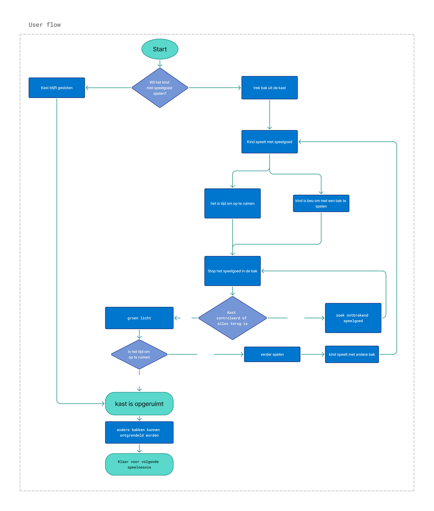

## Develop 1 
Aan de start van deze fase bevatte het product nog een aantal moeilijk te definiëren overbodigheden. Dit kwam voornamelijk omdat de *value promise* nog niet scherp was vastgelegd, waardoor het product te veel verschillende kanten op kon gaan. Hierdoor was de volgende stap in het ontwikkelingsproces onduidelijk.

Het doel van deze fase is om het product volledig te ontleden met behulp van storyboards, user-flows en aanvullende methoden. Daarnaast gebruiken we interviews om overbodige functies te bepalen en bij gebruikers te toetsen wat zij de belangrijkste *value promise* vinden. Zodra al deze informatie is verzameld en gestructureerd, stellen we een morfologische matrix op om een nieuw concept uit te werken.
### Product analyse
#### Storyboard
Na een verdere analyse van het probleem en de bijbehorende voorwaarden is het storyboard aangepast. Het nieuwe storyboard legt meer nadruk op de interactie met het product en schetst een duidelijker beeld van de context waarin het wordt gebruikt.

  

Volgende zijn de 10 verschillende stappen uit het nieuwe storyboard:

1) De vloer ligt vol met speelgoed
2) De ouder bestuurt de kast via een app op de smartphone
3) Er wordt een foto genomen van het speelgoed om het in de kast te registreren
4) Het speelgoed wordt aan een specifieke bak gekoppeld
5) Het speelgoed wordt in de gekoppelde bak geplaatst
6) Het kind kiest een bak om mee te spelen
7) Het kind opent een bak, terwijl de andere bakken vergrendeld blijven
8) Wanneer het tijd is om te stoppen met spelen, wordt een opruimlied afgespeeld
9) Het kind wordt gestimuleerd om het speelgoed op te ruimen
10) Het speelgoed is opgeruimd en de ruimte is weer netjes

#### Functie structuur
Het schema van de productarchitectuur koppelt de gewenste functies direct aan de componenten die hiervoor dienen.

#### Product architectuur
Het interfaceschema toont de fysieke en elektronische verbindingen tussen de systeemonderdelen. Het geeft de subklassen van de componenten weer en benoemt het type connectie

#### User-flow
Deze userflow visualiseert het volledige interactieproces tussen het kind, de kast en het systeem tijdens het spelen en opruimen. Het schema doorloopt de stappen die het kind kan nemen tijdens het gebruik van het product en toont daarnaast de mogelijke controles en reacties van het systeem. Hierdoor wordt duidelijk hoe het kind stap voor stap door het systeem wordt geleid tijdens het spelen en het opruimen van het speelgoed.

#### MVP-definitie
Het Minimum Viable Product (MVP) van ons project is een kast die is onderverdeeld in verschillende bakken. Deze kast wordt gevuld en ingesteld door de ouder. Nadat de ouder de kast heeft ingesteld, kan het kind deze volledig zelfstandig gebruiken. Het kind kan enkel spelen met het speelgoed uit de bak die op dat moment open is. Pas wanneer dit speelgoed weer netjes is opgeruimd, kan het kind een andere bak openen om met nieuw speelgoed te spelen.

### Interviews
Toen we ons product waren aan het ontleden hebben we onder vonden dat we niet echt wisten wat de belangrijkste functies van ons product zijn voor de ouders. Om een beter idee te krijgen over welke functie de ouders belangrijk vinden werden enkele interviews uitgevoerd. Met hun feedback gingen we aan de slag om overbodige functies uit het concept te halen. Tenslotte werd bevraagd welke opruim-strategieën zij zelf gebruikten"

[interview protocol & report](https://ugentbe-my.sharepoint.com/:w:/r/personal/arthur_verhaeghe_ugent_be/Documents/J%202025-2026/project%20gebruiksgericht%20ontwerpen/develop1.docx?d=w6168b8493fe04b6f912cd4a38d781c14&csf=1&web=1&e=qze038)

#### value promise
 De verschillende mogelijke value promises werden aan de respondenten voorgelegd. De respondenten rangschikten de value promises van meest naar minst belangrijk. Dit gaf ons inzicht in welke aspecten zij het meest waardevol vonden. Deze resultaten werden vervolgens gebruikt om de finale rangschikking van de value promises te bepalen. De volgorde gaat als volgt :

1. Een product dat de ouder tijd bespaart door het kind autonomer te laten opruimen.
2. Een product dat de maximale hoeveelheid rommel beperkt, zodat het opruimen behapbaar blijft.
3. Een product waarmee rommel snel en eenvoudig uit het zicht kan worden gewerkt.
4. Een product dat het kind stimuleert om meer op te ruimen door het proces leuker te maken.
5. Een product dat de ouder meer controle geeft over wanneer en met welk speelgoed het kind speelt.

### Morfologiesche matrix

Het concept dat we hebben gekozen om verder uit te werken is een liggende kast. Deze vorm maakt het voor kinderen gemakkelijker om bij de bakken te komen en verhoogt zo de toegankelijkheid van het speelgoed.
Voor het deksel werd gekozen voor een vouwdeksel. Dit type deksel neemt weinig ruimte in wanneer het geopend wordt en is eenvoudig te gebruiken door kinderen. Uit eerder onderzoek bleek dat dit een praktische en gebruiksvriendelijke oplossing is.
De bediening van het systeem gebeurt via een smartphone. Hierdoor zijn er geen extra bedieningselementen nodig en blijven de kosten beperkt.
Om het kind te ondersteunen bij het opruimen werd een klok toegevoegd die als timer of alarm kan worden ingesteld. Daarnaast geeft een speaker feedback wanneer het kind iets fout doet of niet goed begrijpt wat er moet gebeuren. De speaker kan ook een opruimlied afspelen om het zelfstandig opruimen te stimuleren.
Verder zijn er LED-indicatoren die aangeven of een bak correct gesloten is. Tot slot wordt een weegschaal gebruikt om te controleren of het speelgoed correct werd opgeruimd, wat een betrouwbare manier is om dit te controleren.

#### Nieuw concept

